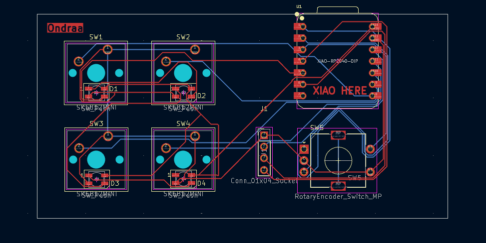

# Deckpad
This Deckpad is my first project using KiCad and Fusion 360, so I chose a simple design and set of features. I plan to use it for Discord and OBS shortcuts, or for general PC control.

##  Features

- 3D printed enclosure designed in Fusion360 and printed in a dark finish
- 128x32 OLED display for showing real-time feedback.
- EC11 Rotary Encoder for volume control and muting.
- 4x SK6812MINI-E LEDs positioned under the keys for lighting effects.
- 4 customizable keys for shortcuts.

## Inspiration

I saw the Hack Club Blueprint program on Instagram and wanted to try it. At home, I love building stuff from whatever I have around. My best projects so far are a 3-way Bluetooth speaker made from a plastic protein tub, and a turntable made from a cardboard printer box. That turntable actually placed in the top 3 for design and sound in a local competition called "Přehraj Desku 2024/25".

For this project, I wanted to do something different. I didn't want to just use "trash" or leftovers from my drawers. I wanted to use good components and make it look like a professional product. So I started my first real project: Build your own Hackpad!

## CAD
Originally, I wanted to make a special pocket for the OLED, but I ended up with a simple cutout because it looked cleaner and was easier to align.

## PCB
It connects the Seeed XIAO to all the components. It was my first time making a custom board, and I'm happy everything fits.

## BOM

- **1x** Seeed XIAO RP2040

- **1x** 0.91" OLED Display (128x32)

- **1x** EC11 Rotary Encoder (with knob)

- **4x** Mechanical Switches

- **4x** Blank DSA keycaps (White)

- **4x** SK6812MINI-E LEDs

- **1x** 3D Printed Case & Deckpad PCB

- **4x** M3x16mm screws

- **4x** M3x5x4mm heatset inserts

- **4x** Small rubber feet (anti-slip)

- **1x** USB-C Cable

## Notes
I really enjoyed moving from building things out of "trash" (like my protein tub speaker) to designing my own custom PCB and professional enclosure.

After I assemble the hardware, I plan to learn more about KMK firmware to fully customize the shortcuts for my favorite apps.
